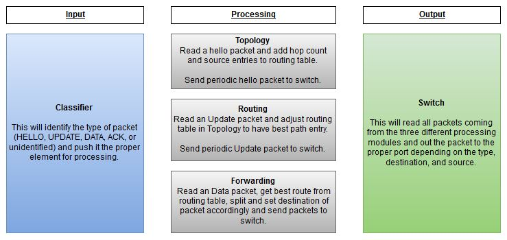

# Multicast Protocol

## Introduction
The goal of this project is to create a multicast protocol to efficiently send
the same packet to multiple hosts within a local network. The assumptions are
that there up to 50 nodes within the network and any host may want to send the
same packet up to 3 nodes. These restrictions are meant to simulate a very
basic IOT scenario. This is often referred to as "k-out-of-n packet datagram
multicast" where n is the number of nodes within the network and k is the number 
of multicast destination nodes.

## Design
The agreed design proposes simple Hello and ACK packet on initialization to
neighboring nodes to receive a vague idea of what the network looks like to
perform simple routing. This design avoids the large packet flooding needed to
fully map the network which helps reduce overhead whenever a node may enter or
leave the network. When a node wishes to send a data packet to k nodes the
sending node matches routes that contain all k destinations and forwards the
packet to the matching node. If it's unable to find a route matching that
criteria it will send a duplicate of the packet to the alternate route. This
has shown to reduce or match at worst case the overall hop count compared to
performing the task through unicast. A more detailed description of routing,
syntax, and example networks can be found
[here](http://www.winlab.rutgers.edu/comnet2/Projects/presentations/group1.ppt).

## Software Architecture

- The network is simulated using the Click modular router library found
  [here](https://github.com/kohler/click/).

### Classifier
- Responsible for identifying the correct packet type and pushing it to the
  proper processing element

### Topology
- Read HELLO packet and add new entry in routing table
- Push periodic HELLO packet to neighboring Switch

### Routing
- Read UPDATE packets and update routing table if new entry has a reduced hop
  count from the existing entry
- Push periodic UPDATE packet to Switch

### Forwarding
- Read incoming DATA packet destination
- Get best route existing in current routing table
- Set the destination of the DATA packet to found route
- Push packet to Switch element

### Switch
- Read all incoming packets from Processing stage and push to proper port
  depending on packet type
